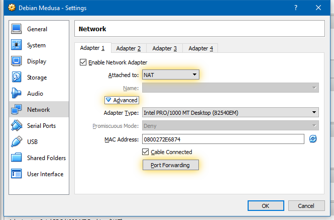
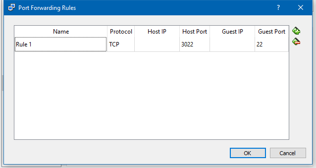

Medusa Integration Testing System
==========================

About
-----
Medusa Integration Testing System (MITS) is based on MTE (Medusa Testing Environment) developed by Roderik Ploszek in 2016.
Link: https://github.com/Programator2/medusa-testing-environment

Prerequisites
-------------

*Medusa Integration Testing System* works on a *VirtualBox* virtual machine with a functional *Medusa* security module.
We recommend the newest version of *VirtualBox*.
For *Medusa* testing and development, we recommend the *Debian* distribution, specifically the Testing distribution that offers a compromise between new versions of packages and stability.

Network settings of the virtual machine
~~~~~~~~~~~~~~~~~~~~~~~~~~~~~~~~~~~~~~~

*Medusa Integration Testing System* communicates with the virtual machine using SSH protocol.
Make sure that virtual machine has functional SSH server.
SSH server is provided by the ``openssh-server`` package on *Debian* distribution.

There are many ways to configure network connection between guest and host operating systems.
We recommend using NAT with port forwarding from the guest port 22 to the host port 3022.
Host port can be set to any value, but it has to be correctly set in the testing environment ``commons.py`` module.

Superuser settings on the virtual machine
~~~~~~~~~~~~~~~~~~~~~~~~~~~~~~~~~~~~~~~~~

Testing environment uses the sudo command extensively and works best if the guest system is configured not to ask for
the password. You can set this up by adding following line to the ``/etc/sudoers`` file::

    username    ALL=NOPASSWD: ALL

Replace *username* with your own username.

Installation instructions
-------------------------

Windows Installation Instructions
~~~~~~~~~~~~~~~~~~~~~~~~~~~~~~~~~

Complete ``commons.py.sample`` file and rename it to ``commons.py``.
Without correct information about virtual machine, the setup procedure won't work.

Install module *win32com* from http://sourceforge.net/projects/pywin32/

Set environment variables.
Via *PowerShell*::

    [Environment]::SetEnvironmentVariable("VBOX_INSTALL_PATH", "C:\Program Files\Oracle\VirtualBox", "Machine")
    [Environment]::SetEnvironmentVariable("VBOX_VERSION", "5.1.8", "Machine")

Replace path to the *VirtualBox* installation folder and its version number if it doesn't correspond to your system.
The last parameter, ``"Machine"`` means that the environment variable is tied to the computer as a whole, don't replace it with a virtual machine name.

Run::

    py -2 setup.py install

Linux Installation Instructions
~~~~~~~~~~~~~~~~~~~~~~~~~~~~~~~

Complete ``commons.py.sample`` file and rename it to ``commons.py``.
Without correct information about virtual machine, the setup procedure won't work.

Run::

    python setup.py install

Configuration of the testing environment
----------------------------------------

Configuration constants are available in the ``commons.py`` module.

Usage
-----

Windows
~~~~~~~

Run::

    py -2 mte\gui.py

Linux
~~~~~

Run::

    python mte/gui.py
